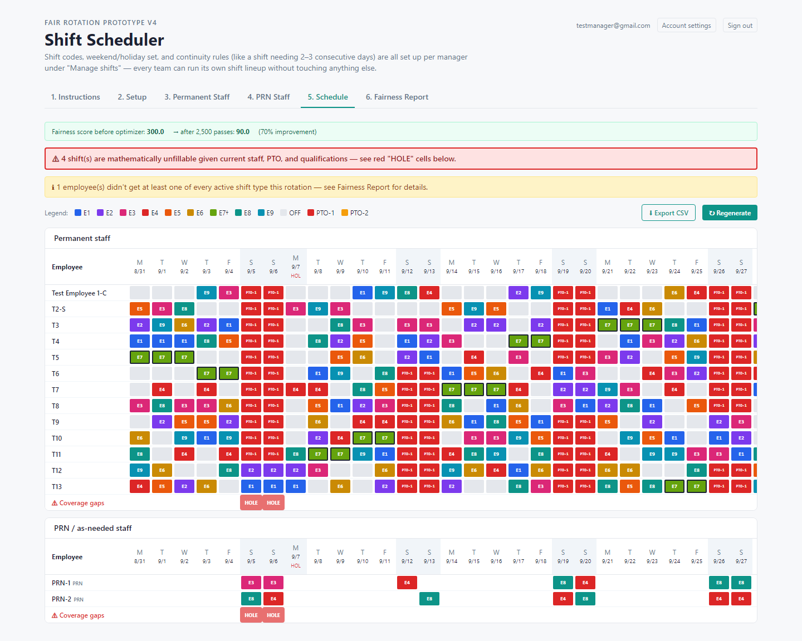
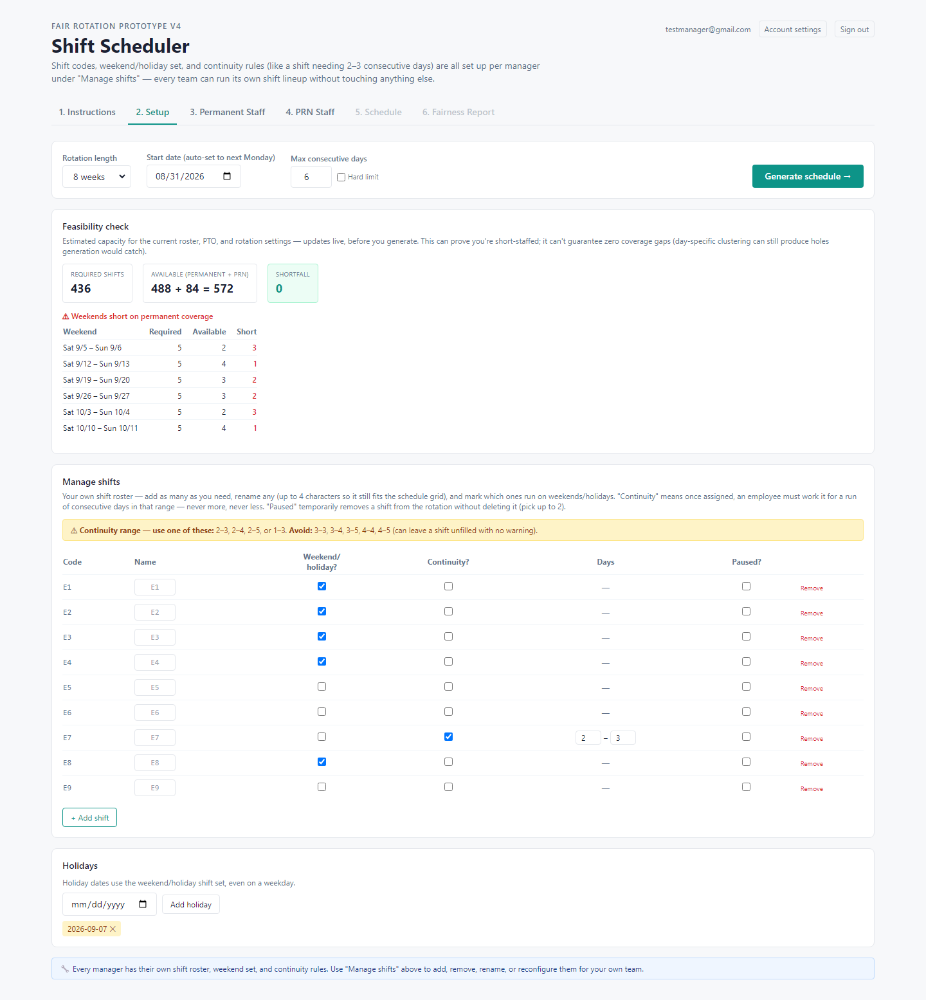
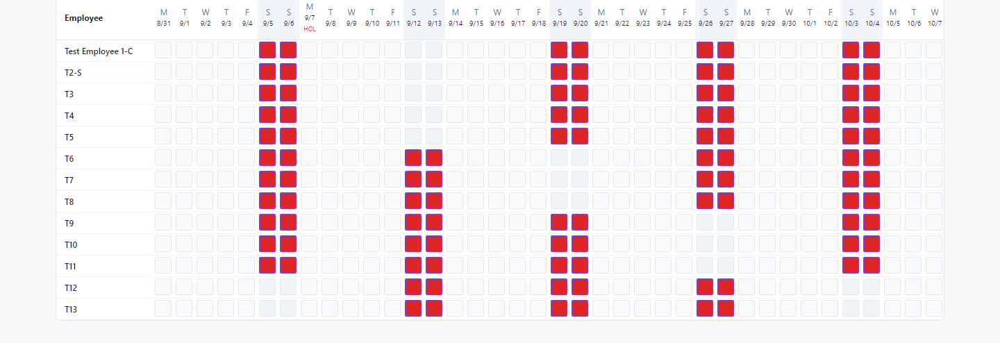
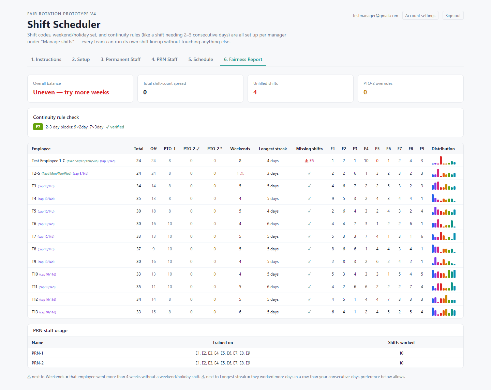

# Shift Scheduler

A multi-tenant shift-scheduling engine that builds fair rotations automatically. Managers set up their team, PTO, and shift rules; the app runs a constraint-based matching and optimization pass to generate a balanced schedule, flags coverage gaps *before* you commit to generating, and reports exactly how fair the result is.

**[Live demo →](https://scheduler-production-1fc2.up.railway.app/)** · **[Repo](https://github.com/NnaHill/Scheduler)**



---

## What it actually does

This isn't a calendar with drag-and-drop — the schedule is *computed*. Given a roster, each employee's PTO/fixed days/hour caps, and a shift roster the manager defines, the app:

1. Runs a **feasibility check** — required shift-slots vs. available capacity, broken down weekend-by-weekend — before you spend a click on generating, so a short-staffed week is visible up front.
2. **Assigns shifts via bipartite matching** (Kuhn's algorithm) day by day, respecting hard constraints in priority order: fixed work days → general availability → PTO-2 overrides → PRN/as-needed backup staff.
3. **Optimizes for fairness** with 2,500 passes of local search — randomly proposing shift swaps and keeping any that reduce a cost function combining shift-count spread, weekend-distribution violations, missing-shift-type coverage, and consecutive-day overruns. The Schedule tab reports the fairness score before and after, with the percentage improvement.
4. **Verifies its own output** — a defense-in-depth pass re-checks continuity rules, shift caps, and fixed-day restrictions actually held in the final schedule, independent of the logic that built it.



## Features

- **Per-manager shift rosters.** Every manager defines and renames their own shift codes, sets weekend/holiday eligibility, and can mark a shift as requiring "continuity" — once assigned, an employee must work it for an unbroken run within a configured day range (e.g. 2–3 days), enforced end to end.
- **Extended-hour / capped staff.** A rolling "at most N shifts in any M-day window" cap for compressed schedules (10s/12s), checked with a sliding window in both directions so it's correct whether the schedule is being built in order or already exists.
- **Weekend rotation groups.** "1 weekend in every N" auto-blocking, computed from a fixed calendar epoch so it's stable regardless of the visible date range — reapplying it never overwrites a manual PTO edit, tracked via a separate `source` field per cell.
- **PTO grid.** Click-to-cycle availability per employee per day — available → PTO-1 (hard, honored no matter what) → PTO-2 (soft, honored unless the schedule genuinely can't cover without them) — plus bulk leave blocking for extended absences.
- **Fairness report.** Per-employee shift-count distribution, longest consecutive streak, missing-shift-type flags, PTO-2 override counts, and continuity-rule verification, all in one table.
- **Multi-tenant with database-level isolation.** Every table is scoped by `owner_id` and enforced with Postgres row-level security (`owner_id = auth.uid() OR is_admin()`) — a manager can only ever see their own data, and an admin account can switch a "viewing as" selector to inspect any manager's roster without a special code path.
- **CSV export** that mirrors the on-screen grid exactly, including override markers and unfilled-shift rows.



## Tech stack


- **Frontend:** React 18 + Vite, Tailwind CSS.
- **Backend/data:** [Supabase](https://supabase.com/) (Postgres, Auth, row-level security) — no separate API server; the client talks to Postgres directly through Supabase's client library, with authorization enforced entirely by RLS policies.
- **Scheduling engine:** framework-free JavaScript (`src/lib/schedulingCore.js`, `src/lib/feasibility.js`) — pure functions shared between the real matcher and the pre-generation capacity estimate, so both are guaranteed to agree.
- **Testing:** [Vitest](https://vitest.dev/), covering the scheduling primitives (date math, weekend-rotation indexing, shift-cap windows, bipartite matching, run partitioning).
- **Hosting:** [Railway](https://railway.app/), served as a static build via a small Node entrypoint (`server.js`) that reads Railway's injected `PORT`.

## Project structure

```
.
├── src/
│   ├── App.jsx                  # Main scheduler UI + the day-by-day assignment walk
│   ├── AuthGate.jsx              # Session/profile gate wrapping the whole app
│   ├── Login.jsx                 # Email/password sign-in
│   ├── AccountSettings.jsx       # Self-service display name + password change
│   └── lib/
│       ├── schedulingCore.js     # Pure scheduling rules — matching, caps, streaks, rotation
│       ├── feasibility.js        # Pre-generation capacity estimate (shares rules with the matcher)
│       ├── csvExport.js          # Schedule → CSV, mirrors the on-screen grid
│       ├── persistence.js        # Supabase reads/writes, scoped per owner_id
│       ├── auth.js               # Sign-in/out, profile fetch, admin profile listing
│       └── supabase.js           # Supabase client init
├── supabase/
│   ├── schema.sql                # Base schema
│   └── migration_*.sql           # Incremental migrations — the move from one shared roster to
│                                  # fully isolated, RLS-enforced multi-tenancy is tracked here
├── server.js                     # Serves the production build; reads Railway's PORT
└── vite.config.js
```

## How the fairness score works

The cost function scores a candidate schedule on:

- **Total shift-count spread** — the gap between the most- and least-worked employee.
- **Per-shift-code spread** — the same idea, but for each shift code individually, so one person isn't always stuck on the same code.
- **Weekend-distribution violations** — anyone who goes more than 4 weeks without a weekend/holiday shift.
- **Missing-shift-type coverage** — every employee should get exposure to every active shift at least once per rotation, if they had any eligible day to work it.
- **Consecutive-day overruns** — in soft mode, this is the only thing driving local search to break up a long streak; in hard mode the constraint is enforced during assignment instead, so this term is always zero.

Local search runs 2,500 random single/paired swaps per generation, keeping only swaps that don't increase the cost — a simple hill-climb, not simulated annealing, but effective given the cost surface here. Capped (extended-hour) employees are excluded from the spread comparisons since their lower shift count is structural, not an imbalance to chase.



## Running locally

```bash
git clone https://github.com/NnaHill/Scheduler.git
cd Scheduler
npm install
cp .env.example .env.local   # fill in your own Supabase project URL + anon key
npm run dev
```

You'll need a Supabase project with the schema in `supabase/schema.sql` applied, followed by the migrations in order — they're numbered and each has a comment explaining what it does and why. `npm test` runs the scheduling-logic unit tests, which don't need Supabase at all.

To build and serve a production bundle the way Railway does:

```bash
npm run build
npm start
```

## Author

Built by [NnaHill](https://github.com/NnaHill).
